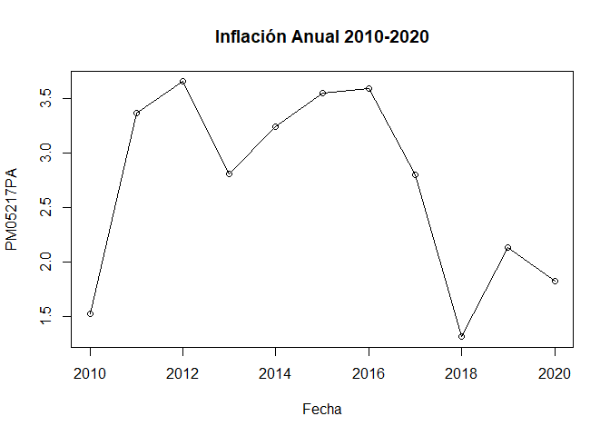

<!-- README.md is generated from README.Rmd. Please edit that file -->

# BCRPR

<!-- badges: start -->
<!-- badges: end -->

El objetivo del paquete es Importar datos del BCRP

## Instalación

Tu puedes instlar esta versión de BCRPR en
[CRAN](https://CRAN.R-project.org) con:

``` r
install.packages("BCRPR")
```

Version desarrollada [GitHub](https://github.com/) con:

``` r
# install.packages("devtools")
devtools::install_github("manosaladata/BCRPR")
```

## Ejemplo

Un ejemplo básico:

``` r
inflacion<-importbcrp('PM05217PA','2010','2020')
plot(inflacion,type = "o",main = "Inflación Anual 2010-2020")
```


